# Vezér Playlist Generator

A TypeScript CLI that generates Vezér (`.vzr`) playlists for the Apotheneum. It
orchestrates DAW playback, Chromatik playback, audio playback, waiting rooms, and the
gaps between tracks.

## Why this exists

When you build a playlist the way it was done before with Vezér, you have to manually set
up the intro track duration. If you want the intro waiting room and then have a track in
multiple positions, you have to edit that five times. This way, it's configured once.

This can also generate a playlist from the command line. What it's really doing: you have
a single configuration file which explains what each kind of track can be. You run a
script, and it generates an entire Vezér playlist. It knows whether it's a Bitwig track or
an Ableton track, and automatically adds the play, stop, and restart sections.

## How tracks are modeled

Two type variants, but three execution modes — `daw` splits by which DAW it drives.

| | Ableton DAW | Bitwig DAW | Vezér-native |
|---|---|---|---|
| **Declaration** | `type: "daw"`, `daw: "ableton"` | `type: "daw"`, `daw: "bitwig"` | `type: "vezer"` |
| **Main timeline** | Generated from config | Generated from config | Loaded from stored XML |
| **Playlist entries per selection** | One: intro + piece merged | One: intro + piece merged | Two: generated intro, then stored piece |
| **Project source** | `project` (`.als`) | `project` (`.bwproject`) | `composition` (XML) |
| **Transport** | `/start`, `/stop` | `/play <1>`, `/play <0>`, plus a defensive reset burst | Owned by the stored XML |
| **Duration** | `duration` (piece only; intro is added on top) | `duration` (piece only; intro is added on top) | Stored in the XML — the generator never knows it |
| **Track LX project** | Opened by the generator from `lxProject` | Opened by the generator from `lxProject` | Opened by the XML; config `lxProject` is **ignored** |
| **DAW preflight** | None | Stop/restart burst 10s after open | None |

Every generated intro — for all three modes — does the same four things: quits both DAWs
for a clean start, opens the waiting-room LX project, plays a waiting-room audio clip, and
fades the master in at the start and out at the end.

## Quick Start

```bash
pnpm install

# Generate a playlist interactively
pnpm generate -o my-playlist.vzr
```

You get a numbered track list; enter an order like `1,2,1,3` (repeats are fine and cost
nothing), set the intro duration, and the `.vzr` is written.

## Adding a track

**A DAW piece** — add a declaration to `tracks` in `src/config.ts`. Nothing else; there is
no XML to produce.

```typescript
"My-Piece": {
  type: "daw",
  daw: "bitwig",
  project: "Bitwig/Projects/Apotheneum/MyPiece.bwproject",
  lxProject: "Apotheneum/me/MyPiece.lxp",
  duration: 1200,          // seconds of the piece itself
  openProjectAhead: 30,    // optional; overrides defaultOpenProjectAhead
},
```

**A Vezér-native piece** — author it in Vezér, save a `.vzr`, then pull the composition
out and reference the extracted file:

```bash
pnpm extract ./MyShow.vzr --output-dir ./compositions
```

```typescript
"My-Generative": {
  type: "vezer",
  composition: "./compositions/My-Generative.xml",
  lxProject: "…",   // currently required by the type, but never read — see below
},
```

## Commands

### `generate` — build a playlist

```bash
pnpm generate [-o playlist.vzr]
```

Prints the numbered track list, takes one comma-separated order (repeats allowed), asks
for the intro duration, and writes the `.vzr`. The generated file has queued-loop and
queued-advance enabled, so the show runs unattended and loops.

### `extract` — pull compositions out of a `.vzr`

```bash
pnpm extract <input.vzr> [--output-dir ./compositions]
```

Use this for Vezér-native pieces whose automation can't be generated.

### `manage` — inspect the library

```bash
pnpm manage
```

Lists configured tracks and the composition files in `./compositions/`, marking which
files are referenced by config (`✓`) and which are orphaned (`○`), and can delete
composition files. Note: it does **not** edit `src/config.ts` — track declarations are
added and removed by hand.

## Generated timelines

### DAW tracks

One composition covers both the waiting room and the piece. Total length is
`introDuration + duration`.

| Time | What happens |
|---|---|
| `0` | Quit both DAWs, open the waiting-room LX project, start waiting-room audio, fade master in over 5s |
| `introEnd − openProjectAhead` | Open the DAW project (default 20s; per-track override) |
| `+10s` after that | **Bitwig only** — defensive stop/restart burst. Ableton gets no preflight. |
| `introEnd − 5s` | Fade master out |
| `introEnd + 1s` | Open the track's `lxProject` |
| `introEnd + 4s` | Press play on the DAW, master back to full |
| `end − 5s` | Fade master out |
| `end − 1s` | Stop transport, quit the DAW |

Note that `openProjectAhead` counts backward from the **end of the intro**, not from
playback — playback starts 4 seconds later, so the DAW actually gets
`openProjectAhead + 4s` of loading time.

Two worked examples, both with a 120s intro. Each is windowed on the last 30 seconds of
the intro and the first seconds of the piece — that is where everything happens. The
waiting room simply runs from 0:00 to that point, and the piece continues to the end of
the composition.

**Ableton** — `MS-Apotheosis` (`duration: 2530`). No preflight: the project is opened and
left alone until play.

```mermaid
gantt
    title Ableton track - final 30s of the intro through the handoff
    dateFormat HH:mm:ss
    axisFormat %M:%S
    section Audio
    Waiting-room audio ends :done, a1, 00:01:30, 00:02:00
    Piece plays            :active, a2, 00:02:04, 00:02:30
    section Chromatik (LX)
    WaitingRoom.BRC.lxp    :done, c1, 00:01:30, 00:02:00
    Open track LX          :milestone, c2, 00:02:01, 0s
    Apotheosis.BRC.lxp     :active, c3, 00:02:01, 00:02:30
    section Ableton
    Open project           :milestone, b1, 00:01:40, 0s
    Loading                :crit, b2, 00:01:40, 00:02:04
    Start                  :milestone, b3, 00:02:04, 0s
    Playing                :active, b4, 00:02:04, 00:02:30
    section Master fader
    Full - intro           :done, m2, 00:01:30, 00:01:55
    Fade out               :m3, 00:01:55, 00:02:00
    Silent across the seam :crit, m4, 00:02:00, 00:02:04
    Full - piece           :done, m5, 00:02:04, 00:02:30
```



**Bitwig** — `DO-Treetop` (`duration: 1200`). Identical shape plus the defensive reset
burst 10s after the project opens.



```mermaid
gantt
    title Bitwig track - final 30s of the intro through the handoff
    dateFormat HH:mm:ss
    axisFormat %M:%S
    section Audio
    Waiting-room audio ends  :done, a1, 00:01:30, 00:02:00
    Piece plays              :active, a2, 00:02:04, 00:02:30
    section Chromatik (LX)
    WaitingRoom.BRC.lxp      :done, c1, 00:01:30, 00:02:00
    Open track LX            :milestone, c2, 00:02:01, 0s
    Treetop Transmission.lxp :active, c3, 00:02:01, 00:02:30
    section Bitwig
    Open project             :milestone, b1, 00:01:40, 0s
    Loading                  :crit, b2, 00:01:40, 00:01:50
    Preflight burst          :crit, b3, 00:01:50, 00:01:52
    Loaded and stopped       :b4, 00:01:52, 00:02:04
    Play                     :milestone, b5, 00:02:04, 0s
    Playing                  :active, b6, 00:02:04, 00:02:30
    section Master fader
    Full - intro             :done, m2, 00:01:30, 00:01:55
    Fade out                 :m3, 00:01:55, 00:02:00
    Silent across the seam   :crit, m4, 00:02:00, 00:02:04
    Full - piece             :done, m5, 00:02:04, 00:02:30
```

Note the deliberate 4-second silence across the seam: the master is faded to zero at the
end of the intro and only returns once the DAW is actually playing, so a slow-loading LX
project never shows as a half-lit stutter.

The two DAW dialects are not interchangeable:

- **Ableton** — `/start` / `/stop` on the `Ableton Out` port; `openLiveProject`,
  `quitLive`.
- **Bitwig** — `/play <1>` / `/play <0>` on the `Bitwig` port; `openBitwigProject`,
  `quitBitwig`. Bitwig's transport does not reliably reset to zero on a single command, so
  the generator emits a burst of `/play <0>` messages bracketing a `/restart` at specific
  frame offsets (`src/lib/daw-track.ts`). **This is deliberate — don't "simplify" it
  without testing on the real rig.**

### Vezér tracks, and what the XML owns

A Vezér selection produces two playlist entries: a generated intro, then the stored
composition inserted as-is. Unlike a DAW track, these are **two separate compositions** in
the playlist, and the generator only authors the first one:

```mermaid
gantt
    title Vezer-native track - the two entries meeting at 2:00
    dateFormat HH:mm:ss
    axisFormat %M:%S
    section Intro (generated)
    Waiting-room audio ends :done, i1, 00:01:30, 00:02:00
    WaitingRoom.BRC.lxp     :done, i2, 00:01:30, 00:02:00
    Master fade out         :i4, 00:01:55, 00:02:00
    section Piece (from XML)
    Ouroborus Mix 48k.wav   :active, v1, 00:02:00, 00:02:45
    Ouroboros.BRC.lxp       :active, v2, 00:02:00, 00:02:45
    Own automation tracks   :active, v3, 00:02:00, 00:02:45
```



The second bar's length comes from the XML, not from config — the generator never knows
it. No DAW appears in either half, because no DAW is involved.

The stored composition owns far more than its visuals — **it owns its own LX project,
audio, transport, duration, and automation.** The generated intro therefore only opens the
waiting room and deliberately does *not* switch to the track's lighting project, because
the composition does that itself on its own timeline. The two halves have agreed
responsibilities: the intro owns the waiting room, the composition owns everything from
its own first frame.

A Vezér track therefore does open LX projects — two of them — but neither comes from its
`lxProject` field. Generating `MS-Generative` emits exactly these, and the configured
`mcslee/Generative.lxp` appears nowhere in the output:

```
openProject <"Apotheneum/mcslee/WaitingRoom.BRC.lxp">   ← generated intro, frame 2
openProject <"Apotheneum/mcslee/Ouroboros.BRC.lxp">     ← from the stored XML
```

> ⚠️ **`lxProject` on a `vezer` track is currently required by the type but never read.**
> `src/lib/intro.ts` only emits the `openProject` keyframe when `type === "daw"`. This is
> schema debt, not intent — the field should be optional or removed. Until then, treat any
> `lxProject` on a Vezér track as decorative, and don't trust it to tell you which
> lighting project the piece loads. To find the truth, read it out of the XML:
>
> ```bash
> grep -o 'openProject &lt;[^<]*' compositions/MS-Generative.xml
> ```
>
> The values in config have already drifted from reality — at time of writing,
> `MS-Generative` declares `mcslee/Generative.lxp` while its XML opens
> `mcslee/Ouroboros.BRC.lxp`.

#### Worked example: `MS-Generative`

```typescript
"MS-Generative": {
  type: "vezer",
  composition: "./compositions/MS-Generative.xml",
  lxProject: "Apotheneum/mcslee/Generative.lxp",  // never read — see warning above
},
```

Selecting it produces two consecutive playlist entries:

1. **`Intro-MS-Generative`** — generated fresh on every run. Quits both DAWs, opens
   `WaitingRoom.BRC.lxp`, plays the waiting-room clip chosen for your intro length, fades
   the master in and back out. No DAW project is opened, because no DAW is involved.
2. **`MS-Generative`** — loaded from `compositions/MS-Generative.xml` and inserted into
   the playlist. Internally it opens `Apotheneum/mcslee/Ouroboros.BRC.lxp`, plays
   `Mark Slee - Ouroborus Mix 48k.wav`, and runs its own automation tracks. Its duration
   lives in the XML, so the generator neither knows nor needs it.

Changing the lighting project for a Vezér track therefore means editing the XML — or
re-authoring in Vezér and re-running `extract` — not editing `src/config.ts`.

## Configuration

All track definitions live in `src/config.ts`. **Abbreviated below** — the real `Config`
also requires `oscPorts` and `audioDevice` (see `src/lib/config.ts` for the full type).

```typescript
const config: Config = {
  fps: 30,
  defaultIntroDuration: 120,   // seconds; the prompt default, applied to every track
  defaultOpenProjectAhead: 20, // seconds before the END of the intro to open the DAW
  waitingRoomLxProject: "path/to/WaitingRoom.lxp",
  waitingRoomAudios: [
    { duration: 30,  path: "/path/to/audio-30s.wav" },
    { duration: 120, path: "/path/to/audio-2m.wav" },
  ],
  // ... oscPorts, audioDevice ...
  tracks: { /* see "Adding a track" above */ },
};
```

**Waiting-room audio selection** picks the *longest* clip that is no longer than the intro;
if every clip is longer than the intro, it falls back to the shortest one
(`selectWaitingRoomAudio` in `src/lib/config.ts`). It does not trim or loop audio, so an
intro length far from any configured clip will leave silence.

**Intro duration is global per playlist, by design.** `generate` asks once and applies the
answer to every track in the run; `defaultIntroDuration` is only the prompt's default. A
show gets one consistent intro length rather than per-track overrides — if you need a
different length, generate a different playlist.

## OSC reference

| Target | Command | Port |
|---|---|---|
| Chromatik | `/apotheneum/openProject <"path.lxp">` | `Chromatik` |
| Ableton | `/apotheneum/openLiveProject <"path.als">` | `Chromatik` |
| Ableton | `/start`, `/stop` | `Ableton Out` |
| Ableton | `/apotheneum/quitLive` | `Chromatik` |
| Bitwig | `/apotheneum/openBitwigProject <"path.bwproject">` | `Chromatik` |
| Bitwig | `/play <1>`, `/play <0>`, `/restart` | `Bitwig` |
| Bitwig | `/apotheneum/quitBitwig` | `Chromatik` |
| Master fader | `/lx/mixer/master/fader` (0–100) | `Chromatik` |

## Development

```
ApothVezerGenerator/
├── src/
│   ├── cli.ts                      # CLI entry point
│   ├── config.ts                   # Track configuration (edit this!)
│   ├── commands/
│   │   ├── extract.ts              # Extract compositions from .vzr
│   │   ├── manage.ts               # List tracks / delete composition files
│   │   └── generate.ts             # Build playlist
│   └── lib/
│       ├── config.ts               # Config types and helpers
│       ├── xml.ts                  # plist parsing / .vzr assembly
│       ├── intro.ts                # Generate intro compositions
│       ├── daw-track.ts            # Generate DAW track compositions
│       └── composition-builder.ts  # Low-level composition XML builder
├── compositions/                   # Stored Vezér-native track XMLs
└── TestTreetopOnly.vzr             # appData template — see below
```

### The `appData` template

`generate` does not synthesize the playlist's `appData` block (OSC port definitions, audio
device, transport button state). It **copies it out of `./TestTreetopOnly.vzr`**, hardcoded
at `src/commands/generate.ts`, then force-enables queued-loop and queued-advance. Keep that
file in the repo — if it goes missing or moves, generated playlists lose their OSC and
audio settings.

A consequence worth knowing: `oscPorts` and `audioDevice` in `src/config.ts` are currently
**not used**. `buildAppData()` in `src/lib/xml.ts` would build that block from them, but
nothing calls it while a template path is supplied. Editing those config values has no
effect on output today.

### Testing individual tracks

```bash
pnpm test DO-Treetop
pnpm test MS-Apotheosis
```

## Known issues

- `lxProject` is required on `vezer` tracks but never read, and the configured values have
  drifted from what the XML actually opens.
- `oscPorts` / `audioDevice` in config are dead — `appData` comes from the `.vzr` template.
- Track paths in `src/config.ts` are absolute and machine-specific
  (`/Users/apotheneum/...`); nothing validates that they exist before generating.
