# Vezér Playlist Generator

A TypeScript CLI that generates Vezér (`.vzr`) playlists for the Apotheneum. It
orchestrates DAW playback, Chromatik playback, audio playback, waiting rooms, and the
gaps between tracks.

## Why this exists

When you build a playlist the way it was done before with Vezér, you have to manually set
up the intro track duration. If you want the intro waiting room and then have a track in
multiple positions, you have to edit that five times. This way, it's configured once.

This can also generate a playlist from the command line. What it's really doing: you have
a single configuration file which explains what each kind of track can be. You run a
script, and it generates an entire Vezér playlist. It knows whether it's a Bitwig track or
an Ableton track, and automatically adds the play, stop, and restart sections.

## How tracks are modeled

Two type variants, but three execution modes — `daw` splits by which DAW it drives.

| | Ableton DAW | Bitwig DAW | Vezér-native |
|---|---|---|---|
| **Declaration** | `type: "daw"`, `daw: "ableton"` | `type: "daw"`, `daw: "bitwig"` | `type: "vezer"` |
| **Main timeline** | Generated from config | Generated from config | Loaded from stored XML |
| **Playlist entries per selection** | One: intro + piece merged | One: intro + piece merged | Two: generated intro, then stored piece |
| **Duration** | `duration` (piece only; intro is added on top) | `duration` (piece only; intro is added on top) | Stored in the XML — the generator never knows it |
| **Track LX project** | Opened by the generator from `lxProject` | Opened by the generator from `lxProject` | Opened by the XML; there is no config field for it |
| **DAW preflight** | None | Stop/restart burst 10s after open | None |

Every generated intro — for all three modes — does the same four things: quits both DAWs
for a clean start, opens the waiting-room LX project, plays a waiting-room audio clip, and
fades the master in at the start and out at the end.

## Quick Start

```bash
pnpm install

# Generate a playlist interactively
pnpm generate -o my-playlist.vzr
```

You get a numbered track list; enter an order like `1,2,1,3` (repeats are fine and cost
nothing), set the intro duration, and the `.vzr` is written.

## Adding a track

**A DAW piece** — add a declaration to `tracks` in `src/config.ts`. Nothing else; there is
no XML to produce.

```typescript
"My-Piece": {
  type: "daw",
  daw: "bitwig",
  project: "Bitwig/Projects/Apotheneum/MyPiece.bwproject",
  lxProject: "Apotheneum/me/MyPiece.lxp",
  duration: 1200,          // seconds of the piece itself
  openProjectAhead: 30,    // optional; overrides defaultOpenProjectAhead
},
```

**A Vezér-native piece** — author it in Vezér, save a `.vzr`, then pull the composition
out and reference the extracted file:

```bash
pnpm extract ./MyShow.vzr --output-dir ./compositions
```

```typescript
"My-Generative": {
  type: "vezer",
  composition: "./compositions/My-Generative.xml",
},
```

## Commands

### `generate` — build a playlist

```bash
pnpm generate [-o playlist.vzr]
```

Prints the numbered track list, takes one comma-separated order (repeats allowed), asks
for the intro duration, and writes the `.vzr`. The generated file has queued-loop and
queued-advance enabled, so the show runs unattended and loops.

### `extract` — pull compositions out of a `.vzr`

```bash
pnpm extract <input.vzr> [--output-dir ./compositions]
```

Use this for Vezér-native pieces whose automation can't be generated.

### `manage` — inspect the library

```bash
pnpm manage
```

Lists configured tracks and the composition files in `./compositions/`, marking which
files are referenced by config (`✓`) and which are orphaned (`○`), and can delete
composition files. Note: it does **not** edit `src/config.ts` — track declarations are
added and removed by hand.

## Generated timelines

### DAW tracks

One composition covers both the waiting room and the piece. Total length is
`introDuration + duration`.

Note that `openProjectAhead` counts backward from the **end of the intro**, not from
playback — playback starts 4 seconds later, so the DAW actually gets
`openProjectAhead + 4s` of loading time.

One worked example, with a 120s intro, windowed on the last 30 seconds of the intro and
the first seconds of the piece — that is where everything happens. The waiting room simply
runs from 0:00 to that point, and the piece continues to the end of the composition.

An Ableton track is the same shape with the preflight row removed: the project is opened,
left alone while it loads, and started at the same moment.

**Bitwig** — `DO-Treetop`. The preflight burst at 1:50 is the Bitwig-only part.

```mermaid
gantt
    title Bitwig track - final 30s of the intro through the handoff
    dateFormat HH:mm:ss
    axisFormat %M:%S
    section Audio
    Waiting-room audio ends  :done, a1, 00:01:30, 00:02:00
    Piece plays              :active, a2, 00:02:04, 00:02:30
    section Chromatik (LX)
    WaitingRoom.BRC.lxp      :done, c1, 00:01:30, 00:02:00
    Open track LX            :milestone, c2, 00:02:01, 0s
    Treetop Transmission.lxp :active, c3, 00:02:01, 00:02:30
    section Bitwig
    Open project             :milestone, b1, 00:01:40, 0s
    Loading                  :crit, b2, 00:01:40, 00:01:50
    Preflight burst          :crit, b3, 00:01:50, 00:01:52
    Loaded and stopped       :b4, 00:01:52, 00:02:04
    Play                     :milestone, b5, 00:02:04, 0s
    Playing                  :active, b6, 00:02:04, 00:02:30
    section Master fader
    Full - intro             :done, m2, 00:01:30, 00:01:55
    Fade out                 :m3, 00:01:55, 00:02:00
    Silent across the seam   :crit, m4, 00:02:00, 00:02:04
    Full - piece             :done, m5, 00:02:04, 00:02:30
```



Note the deliberate 4-second silence across the seam: the master is faded to zero at the
end of the intro and only returns once the DAW is actually playing, so a slow-loading LX
project never shows as a half-lit stutter.

The two dialects are not interchangeable (see the OSC reference below). Bitwig's transport
does not reliably reset to zero on a single command, so the generator emits a burst of
`/play <0>` messages bracketing a `/restart` at specific frame offsets
(`src/lib/daw-track.ts`). **This is deliberate — don't "simplify" it without testing on the
real rig.**

### Vezér tracks, and what the XML owns

A Vezér selection produces two playlist entries: a generated intro, then the stored
composition inserted as-is. Unlike a DAW track, these are **two separate compositions** in
the playlist, and the generator only authors the first one:

```mermaid
gantt
    title Vezer-native track - the two entries meeting at 2:00
    dateFormat HH:mm:ss
    axisFormat %M:%S
    section Intro (generated)
    Waiting-room audio ends :done, i1, 00:01:30, 00:02:00
    WaitingRoom.BRC.lxp     :done, i2, 00:01:30, 00:02:00
    Master fade out         :i4, 00:01:55, 00:02:00
    section Piece (from XML)
    Ouroborus Mix 48k.wav   :active, v1, 00:02:00, 00:02:45
    Ouroboros.BRC.lxp       :active, v2, 00:02:00, 00:02:45
    Own automation tracks   :active, v3, 00:02:00, 00:02:45
```



The second bar's length comes from the XML, not from config — the generator never knows
it. To find a Vezér piece's real duration, read `compTime` (in seconds) out of the
composition: `grep -A1 '<key>compTime</key>' compositions/MS-Generative.xml` gives `8325`,
i.e. 2h19m. You need this to work out a show's total runtime, since `manage` and
`generate` can't tell you. No DAW appears in either half, because no DAW is involved.

The stored composition owns its own LX project, audio, transport, duration, and
automation. The intro owns only the waiting room. So a Vezér track does open LX projects —
two of them — and neither is named in `src/config.ts`: a `vezer` declaration carries only
`type` and `composition`. Generating `MS-Generative` emits exactly these:

```
openProject <"Apotheneum/mcslee/WaitingRoom.BRC.lxp">   ← generated intro, frame 2
openProject <"Apotheneum/mcslee/Ouroboros.BRC.lxp">     ← from the stored XML
```

To find out which lighting project a Vezér piece loads, read it out of the XML — that is
the only place the answer exists:

```bash
grep -o 'openProject &lt;[^<]*' compositions/MS-Generative.xml
```

## Configuration

All track definitions live in `src/config.ts`. **Abbreviated below** — the real `Config`
also requires `oscPorts` and `audioDevice` (see `src/lib/config.ts` for the full type).

```typescript
const config: Config = {
  fps: 30,
  defaultIntroDuration: 120,   // seconds; the prompt default, applied to every track
  defaultOpenProjectAhead: 20, // seconds before the END of the intro to open the DAW
  waitingRoomLxProject: "path/to/WaitingRoom.lxp",
  waitingRoomAudios: [
    { duration: 30,  path: "/path/to/audio-30s.wav" },
    { duration: 120, path: "/path/to/audio-2m.wav" },
  ],
  // ... oscPorts, audioDevice ...
  tracks: { /* see "Adding a track" above */ },
};
```

**Waiting-room audio selection** picks the *longest* clip that is no longer than the intro;
if every clip is longer than the intro, it falls back to the shortest one
(`selectWaitingRoomAudio` in `src/lib/config.ts`). It does not trim or loop audio, so an
intro length far from any configured clip will leave silence.

**Intro duration is global per playlist, by design.** `generate` asks once and applies the
answer to every track in the run; `defaultIntroDuration` is only the prompt's default. A
show gets one consistent intro length rather than per-track overrides — if you need a
different length, generate a different playlist.

### Path conventions

`src/config.ts` mixes three rooted path styles. They look inconsistent because they are
resolved by three different things:

| Field | Resolved by | Style |
|---|---|---|
| `lxProject`, `waitingRoomLxProject`, `project` | **The receiving app**, not this tool — the value is passed verbatim as an OSC argument to Chromatik or the DAW opener | `Apotheneum/mcslee/WaitingRoom.BRC.lxp`, `Bitwig/Projects/Apotheneum/X.bwproject` |
| `composition` | **This tool**, relative to the working directory — `generate` opens it with `readFile` | `./compositions/X.xml` |
| `waitingRoomAudios[].path` | **Vezér**, at playback — embedded verbatim into the composition as `soundURL` | absolute (`/Users/apotheneum/...`) |

The practical consequence: only `composition` fails at generation time if it's wrong. A bad
`lxProject` or `project` generates a perfectly valid `.vzr` and fails silently on the rig,
and a bad audio path fails when Vezér opens the file. Nothing validates any of them.

> What the app-resolved paths are relative to on the show machine is **unverified here** —
> it's rig-side configuration, not something this repo controls. Copy the style of an
> existing entry rather than guessing.


## OSC reference

| Target | Command | Port |
|---|---|---|
| Chromatik | `/apotheneum/openProject <"path.lxp">` | `Chromatik` |
| Ableton | `/apotheneum/openLiveProject <"path.als">` | `Chromatik` |
| Ableton | `/start`, `/stop` | `Ableton Out` |
| Ableton | `/apotheneum/quitLive` | `Chromatik` |
| Bitwig | `/apotheneum/openBitwigProject <"path.bwproject">` | `Chromatik` |
| Bitwig | `/play <1>`, `/play <0>`, `/restart` | `Bitwig` |
| Bitwig | `/apotheneum/quitBitwig` | `Chromatik` |
| Master fader | `/lx/mixer/master/fader` (0–100) | `Chromatik` |

## Development

`src/cli.ts` is the entry point and `src/config.ts` is the file you edit. The generators
live in `src/lib/` — `intro.ts` and `daw-track.ts` build compositions on top of
`composition-builder.ts`, and `xml.ts` handles plist parsing and `.vzr` assembly.

### The `appData` template

`generate` does not synthesize the playlist's `appData` block (OSC port definitions, audio
device, transport button state). It **copies it out of `./TestTreetopOnly.vzr`**, hardcoded
at `src/commands/generate.ts`, then force-enables queued-loop and queued-advance. Keep that
file in the repo — it is load-bearing.

If the template is missing, moved, or its `appData` block can't be parsed, `buildVzrFile()`
now **throws** and the CLI exits non-zero, naming the file in the error. It no longer falls
back to an empty `appData` dict, which used to produce a playlist with no OSC or audio
configuration — a failure that would only surface live, during playback.

A consequence worth knowing: `oscPorts` and `audioDevice` in `src/config.ts` are currently
**not used**. `buildAppData()` in `src/lib/xml.ts` would build that block from them, but
nothing calls it while a template path is supplied. Editing those config values has no
effect on output today.

### Checking a playlist before a show

The generated file is plain XML, so it can be verified without opening Vezér:

```bash
# How many compositions? (DAW tracks = 1 each, Vezér tracks = 2 each)
grep -c '<key>Comp-' playlist.vzr

# Every project switch, in playlist order — the fastest way to spot a wrong or missing one
grep -o 'openProject &lt;[^<]*' playlist.vzr

# The appData block must be present, or there is no OSC configuration at all
grep -c '<key>appData</key>' playlist.vzr

# Unattended playback: both must be <true/>
for k in queuedLoopButton queuedModeButton; do
  printf "%s " $k
  grep -A8 "$k" playlist.vzr | grep -A1 '<key>state</key>' | tail -1
done
```

Escaping differs between halves — a generated intro writes `&quot;` where a stored
composition writes a literal `"` — so match on `openProject` rather than on the quotes.


### Testing individual tracks

```bash
pnpm test DO-Treetop
pnpm test MS-Apotheosis
```
